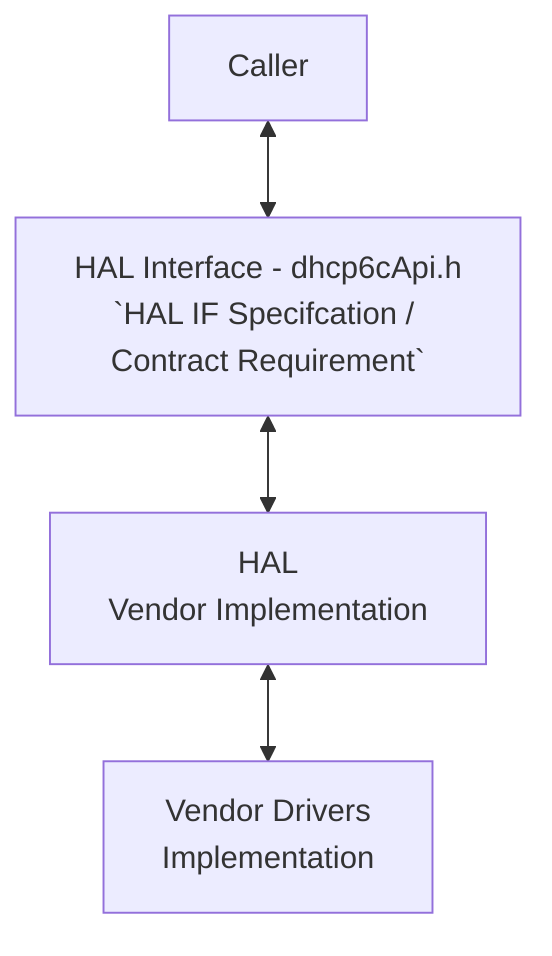
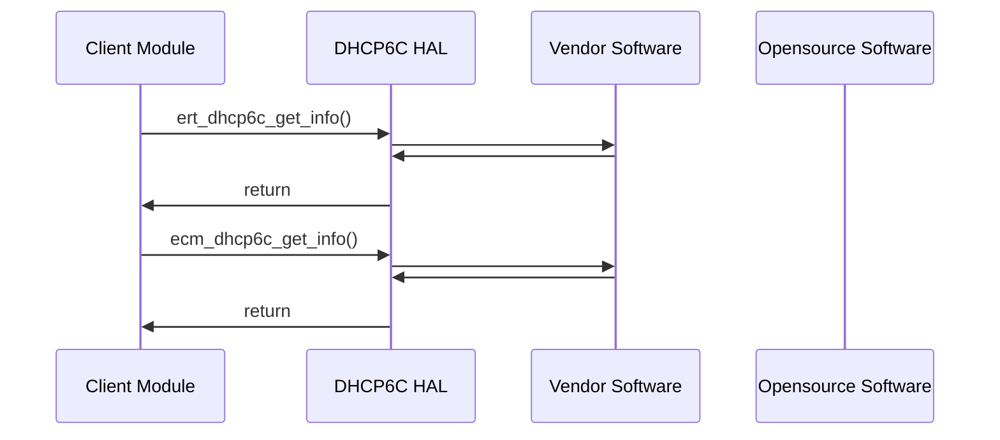

# DHCP6C HAL Documentation

## Acronyms

- `HAL` \- Hardware Abstraction Layer
- `RDK-B` \- Reference Design Kit for Broadband Devices
- `OEM` \- Original Equipment Manufacture

## Description

The DHCP6c HAL (Hardware Abstraction Layer) is a software module designed to provide a standardized interface for interacting with DHCPv6 client functionalities on different devices. It acts as a bridge between higher-level software components and the vendor-specific implementation of the DHCPv6 client. The primary goal of the DHCP6c HAL is to abstract the complexities of the underlying DHCPv6 client implementation, allowing applications to access essential information and functionalities without needing to know the specific details of the device's hardware or software. The diagram below describes a high-level software architecture of the DHCP6C HAL module stack.

## Component Runtime Execution Requirements

### Initialization and Startup

There is no dependent API's is expected to be intialized for invoking DHCP6C HAL client module.

3rd party vendors will implement appropriately to meet operational requirements. This interface is expected to block if the hardware is not ready.

## Threading Model

Vendors may implement internal threading and event mechanisms to meet their operational requirements. These mechanisms must be designed to ensure thread safety when interacting with HAL interface. Proper cleanup of allocated resources (e.g., memory, file handles, threads) is mandatory when the vendor software terminates or closes its connection to the HAL.

This interface is not inherently required to be thread-safe. It is the responsibility of the calling module or component to ensure that all interactions with the APIs are properly synchronized.

**Implementation Guidance for Vendors:**

Vendors are free to use internal threading or event mechanisms within their implementation as needed to fulfill operational requirements. However, any such mechanisms must:

- **Synchronize Access:** Implement appropriate synchronization primitives (e.g., mutexes, semaphores) to prevent race conditions and ensure data integrity when accessing the APIs.
- **Resource Management:** Ensure proper cleanup and release of any resources (e.g., memory, threads) allocated during the lifetime of the instance, especially during module shutdown or disconnection.

## Process Model

All APIs are expected to be called from multiple processes. Due to this concurrent access, vendors must implement protection mechanisms within their API implementations to handle multiple processes calling the same API simultaneously. This is crucial to ensure data integrity, prevent race conditions, and maintain the overall stability and reliability of the system.

## Memory Model

**Caller Responsibilities:**

Manage memory passed to specific functions as outlined in the API documentation. This includes allocation and deallocation to prevent leaks.

**Module Responsibilities:**

- Modules must allocate and de-allocate memory for their internal operations, ensuring efficient resource management.
- Modules are required to release all internally allocated memory upon closure to prevent resource leaks.
- All module implementations and caller code must strictly adhere to these memory management requirements for optimal performance and system stability. Unless otherwise stated specifically in the API documentation.
- All strings used in this module must be zero-terminated. This ensures that string functions can accurately determine the length of the string and prevents buffer overflows when manipulating strings.

TODO:
State a footprint requirement. Example: This should not exceed XXXX KB.

## Power Management Requirements

The HAL is not involved in any of the power management operation.

## Asynchronous Notification Model

There are no asynchronous notifications.

## Blocking calls

**Synchronous and Responsive:** All APIs within this module should operate synchronously and complete within a reasonable timeframe based on the complexity of the operation. Specific timeout values or guidelines may be documented for individual API calls.

**Timeout Handling:** To ensure resilience in cases of unresponsiveness, implement appropriate timeouts for API calls where failure due to lack of response is a possibility. Refer to the API documentation for recommended timeout values per function.

**Non-Blocking Requirement:** Given the single-threaded environment in which these APIs will be called, it is imperative that they do not block or suspend execution of the main thread. Implementations must avoid long-running operations or utilize asynchronous mechanisms where necessary to maintain responsiveness.

TODO:
As we state that they should complete within a time period, we need to state what that time target is, and pull it from the spec if required. Define the timeout requirement.

## Internal Error Handling

**Synchronous Error Handling:** All APIs must return errors synchronously as a return value. This ensures immediate notification of errors to the caller.

**Internal Error Reporting:** The HAL is responsible for reporting any internal system errors (e.g., out-of-memory conditions) through the return value.

**Focus on Logging for Errors:** For system errors, the HAL should prioritize logging the error details for further investigation and resolution.

## Persistence Model

There is no requirement for HAL to persist any setting information. The caller is responsible to persist any settings related to their implementation.

## Nonfunctional requirements

Following non functional requirement should be supported by the component.

## Logging and debugging requirements

The component is required to record all errors and critical informative messages to aid in identifying, debugging, and understanding the functional flow of the system. Logging should be implemented using the syslog method, as it provides robust logging capabilities suited for system-level software. The use of `printf` is discouraged unless `syslog` is not available.

All HAL components must adhere to a consistent logging process. When logging is necessary, it should be performed into the `dhcp6c_vendor_hal.log` file, which is located in either the `/var/tmp/` or `/rdklogs/logs/` directories.

Logs must be categorized according to the following log levels, as defined by the Linux standard logging system, listed here in descending order of severity:

- **FATAL:** Critical conditions, typically indicating system crashes or severe failures that require immediate attention.
- **ERROR:** Non-fatal error conditions that nonetheless significantly impede normal operation.
- **WARNING:** Potentially harmful situations that do not yet represent errors.
- **NOTICE:** Important but not error-level events.
- **INFO:** General informational messages that highlight system operations.
- **DEBUG:** Detailed information typically useful only when diagnosing problems.
- **TRACE:** Very fine-grained logging to trace the internal flow of the system.

Each log entry should include a timestamp, the log level, and a message describing the event or condition. This standard format will facilitate easier parsing and analysis of log files across different vendors and components.

## Memory and performance requirements

**Client Module Responsibility:** The client module using the HAL is responsible for allocating and deallocating memory for any data structures required by the HAL's APIs. This includes structures passed as parameters to HAL functions and any buffers used to receive data from the HAL.

**Vendor Implementation Responsibility:** Third-party vendors, when implementing the HAL, may allocate memory internally for their specific operational needs. It is the vendor's sole responsibility to manage and deallocate this internally allocated memory.

## Quality Control

To ensure the highest quality and reliability, it is strongly recommended that third-party quality assurance tools like `Coverity`, `Black Duck`, and `Valgrind` be employed to thoroughly analyze the implementation. The goal is to detect and resolve potential issues such as memory leaks, memory corruption, or other defects before deployment.

Furthermore, both the HAL wrapper and any third-party software interacting with it must prioritize robust memory management practices. This includes meticulous allocation, deallocation, and error handling to guarantee a stable and leak-free operation.

## Licensing

DHCP6C HAL implementation is expected to released under the Apache License 2.0.

## Build Requirements

The source code should be capable of, but not be limited to, building under the Yocto distribution environment. The recipe should deliver a shared library named as `libdhcp6cApi.so`

## Variability Management

The role of adjusting the interface, guided by versioning, rests solely within architecture requirements. Thereafter, vendors are obliged to align their implementation with a designated version of the interface. As per Service Level Agreement (SLA) terms, they may transition to newer versions based on demand needs.

Each API interface will be versioned using Semantic Versioning 2.0.0, the vendor code will comply with a specific version of the interface.

## DHCP6C or Product Customization

None

## Interface API Documentation

All HAL function prototypes and datatype definitions are available in `dhcp6cApi.h` file.

1. Components/Process must include `dhcp6cApi.h` to make use of DHCP6C hal capabilities.
2. Components/Process should add linker dependency for `libdhcp6cApi.so`

## Theory of operation and key concepts

DHCP6C HAL Object Lifecycles, Method Sequencing, and State-Dependent Behaviour

**Object Lifecycles:**

- **No Explicit Object Creation:** The DHCP6C HAL interface, as presented, does not involve explicit creation or destruction of objects within the HAL itself. The primary "object" in this context is the DHCPv6 client configuration and state information, which is maintained by the underlying vendor implementation.

- **Data Retrieval:** The HAL APIs (`ert_dhcp6c_get_info` and `ecm_dhcp6c_get_info`) are designed to retrieve existing DHCPv6 client information from the vendor implementation and populate a `dhcp6cInfo_t` structure provided by the caller. The lifecycle of this structure is managed by the calling module.

**Method Sequencing:**

- **No Strict Sequencing:** There is no explicit requirement for a specific order in which the methods must be called. However, it is implied that the initialization and configuration of the DHCPv6 client within the vendor implementation would happen before the HAL APIs are used to retrieve information.

- **Initialization Responsibility:** The responsibility for initializing and configuring the DHCPv6 client lies with the vendor implementation and potentially with higher-level components that manage the network configuration.

**State-Dependent Behaviour:**

- **Implicit State Dependency:** While not explicitly stated, the behaviour of the HAL APIs is inherently state-dependent. The information returned by the `ert_dhcp6c_get_info` and `ecm_dhcp6c_get_info` functions will depend on the current state of the DHCPv6 client within the vendor implementation.

- **Potential Blocking:** The documentation mentions that the interface may block if the underlying hardware is not ready, suggesting that the API calls could have different behaviours based on the underlying system's state.

## Sequence Diagram

